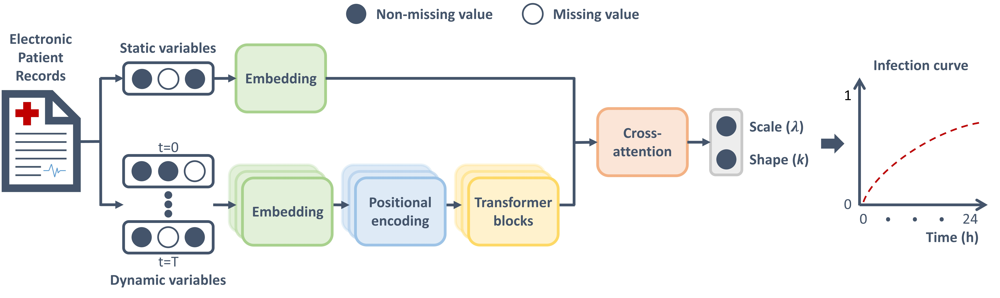

# [TITLE] 

🚀 The paper was accepted to **[TBD]**.

The preprint is available on **[TBD]**.

## Authors

**Ioannis Bouzalas**; **Hung Chu**; **Marit de Vries**; **Machteld van Scherpenzeel - de Vries**; **Tina Faber**; **Frank Verhoog**; **Jiapan Guo**; **Mark-Jan Ploegstra**

## Abstract

*[TBD: Insert paper abstract here]*

## Deep learning-based survival model



This repository implements a **deep learning-based survival model** for predicting infection risk in neonates 
using the **Accelerated Failure Time (AFT)** framework. The model processes both static (patient-level) and dynamic 
(time-varying) variables to predict survival probabilities over a 24-hour horizon.

### Key Components:
- **Learnable positional embeddings** for a dense representation of static and dynamic variables, and missingness patterns
- **Positional encoding** for capturing irregular measurement intervals
- **Transformer blocks** for capturing temporal patterns
- **Cross-attention mechanism** for combining extracted information from static and dynamic variables

## Results

|       **Metric**        | ***Cross-validation (n=274)** | ****Independent test (n=70)** |
|:-----------------------:|:-----------------------------:|:-----------------------------:|
|  C-Index <br> [95% CI]  |     0.84 <br> [0.76–0.93]     |     0.85 <br> [0.84–0.87]     |
|    AUC <br> [95% CI]    |     0.88 <br> [0.77–0.98]     |     0.89 <br> [0.87–0.91]     |
| IBS <br> [95% CI] |     0.07 <br> [0.05–0.10]     |     0.05 <br> [0.04–0.05]     |

**Averaged over 5 folds.* <br>
***Bootstrapping with 1,000 samples.*


## Data

**Note**: Due to privacy regulations, the original patient data cannot be shared. However, we provide the data structure 
and an example to help users understand the expected format.

### Data Structure

The model expects a `data_dict.pickle` file with the following nested dictionary structure:

```
data_dict/
├── patient_id (str)
│   └── encounter_id (str)
│       ├── dynamic_times: List[float]      # Observation times in minutes
│       ├── static_features: List[List[float]]   # Patient-level variables (1 × D_stat)
│       ├── dynamic_features: List[List[float]]  # Time-series variables (T × D_dyn)
│       ├── result_time: List[float]        # Time to event/censoring (minutes)
│       └── result_label: List[int]         # Event indicator (1=event, 0=censored)
```

### Data Example

Create your own `data_dict.pickle` following this structure:

```python
import pickle
import numpy as np
from collections import defaultdict

# Skeleton data structure
data_dict = {
    # Each key: patient_id
    '100000': defaultdict(dict, {
        # Each key: encounter_id
        '200000': {
            'static_features': [
                # [Apgar_1, Apgar_5, GestationalAgeDays, Weight_g, Length_cm, Partustype_Sectio]
                [6.0, 8.0, np.nan, 1250.0, 38.0, 1.0]
            ],
            'dynamic_times': [0.0, 60.0, 111.0, 209.0],  # Observation times in minutes
            'dynamic_features': [
                # Each row: [Pulse, SpO2, O2_Flow, Resp_Rate, Temp, SpO2_drops, SpO2_duration, SpO2_event, Brady_count, Brady_rate, Incident Count]
                [np.nan, 98.0, np.nan, np.nan, 36.5, 0.0, np.nan, 0.0, 0.0, np.nan, 0.0],
                [140.0, np.nan, 0.5, 42.0, np.nan, 1.0, 5.0, 1.0, np.nan, np.nan, 1.0],
                [np.nan, np.nan, 0.0, np.nan, 36.6, np.nan, np.nan, 1.0, 0.0, np.nan, 0.0],
                [145.0, 96.0, np.nan, 44.0, np.nan, 2.0, 8.0, np.nan, np.nan, 80.0, np.nan],
            ],
            'result_time': [240.0],  # Time to event/censoring in minutes
            'result_label': [0]      # 0 = censored, 1 = infection event
        }
    }),
    '100001': defaultdict(dict, {
        '200001': {
            'static_features': [
                [4.0, 6.0, 196.0, np.nan, np.nan, 0.0]
            ],
            'dynamic_times': [0.0, 90.0, 110.0],
            'dynamic_features': [
                [np.nan, 95.0, 1.0, np.nan, 35.8, 3.0, np.nan, 1.0, 2.0, np.nan, np.nan],
                [165.0, np.nan, 2.0, 60.0, np.nan, 5.0, 20.0, 1.0, np.nan, np.nan, 8.0],
                [170.0, 88.0, np.nan, 65.0, 35.2, np.nan, 25.0, np.nan, np.nan, 65.0, 12.0],
            ],
            'result_time': [120.0],
            'result_label': [1] 
        }
    }),
    # Add more patients as needed...
}

# Save the data dictionary
with open('data/data_dict.pickle', 'wb') as f:
    pickle.dump(data_dict, f)
```

### Variable Descriptions

#### Static Variables (patient-level, 6 variables, sorted alphabetically):
| Variable          | Description |
|-------------------|-------------|
| Apgar 1min        | Apgar score at 1 minute after birth |
| Apgar 5min        | Apgar score at 5 minutes after birth |
| Birth length      | Length at birth (cm) |
| Birth weight      | Weight at birth (grams) |
| Cesarean delivery | Binary indicator for cesarean section |
| Gestational age   | Gestational age in days |


#### Dynamic Variables (time-varying, 11 variables, sorted alphabetically):
| Variable              | Description |
|-----------------------|-------------|
| Body temperature      | Body temperature (°C) |
| Bradycardia count     | Number of bradycardia episodes |
| Bradycardia duration  | Duration of bradycardia |
| Desaturation duration    | Duration of oxygen saturation drops (seconds) |
| Desaturation event count      | Number of oxygen saturation drops |
| Event SpO2            | SpO2 event indicator |
| Heart rate            | Heart rate (beats per minute) |
| Oxygen support level  | Supplemental oxygen flow rate |
| Respiratory rate      | Breathing rate (breaths per minute) |
| SpO2                  | Oxygen saturation (%) |
| Total incident count  | Count of clinical incidents |


## Installation

### Requirements

- Python 3.12.3
- PyTorch 2.5.1+cu121
- CUDA

See `requirements.txt` for the complete list of dependencies.

### Setup the Environment

```bash
git clone https://github.com/HC94/dl_neonatal_infections.git
cd neonatal_infections
pip install -r requirements.txt
```


## How to Use

### Training

The main training script uses Optuna for hyperparameter optimization with cross-validation:

```bash
python main.py
```

#### Configuration Options

Key parameters can be configured in `main.py`:

| Parameter | Default | Description                             |
|-----------|---------|-----------------------------------------|
| `PERFORM_TEST` | `True` | Quick test mode (reduced epochs/trials) |
| `NUM_BINS` | `24` | Prediction horizon (in hours)           |
| `NUM_EPOCHS` | `100` | Maximum training epochs                 |
| `NUM_FOLDS` | `5` | Number of cross-validation folds        |
| `OPTUNA_METRIC` | `'c_index'` | Validation metric to optimize           |
| `OPTUNA_N_TRIALS` | `250` | Number of hyperparameter trials         |


### Project Structure

```
neonatal_infections/
├── main.py                   # Training entry point with Optuna
├── data.py                   # Data loading and preprocessing
├── models.py                 # Transformer model architecture
├── losses.py                 # Loss functions (AFT, calibration)
├── training.py               # Training loop
├── evaluation.py             # Metrics and evaluation
├── shap_analysis.py          # SHAP interpretability analysis
├── utils.py                  # Utility functions
└── README.md                 # This file
```


### SHAP Analysis

For model interpretability using SHAP analysis:

```python
from shap_analysis import compute_and_plot_shap

# After loading your trained model
compute_and_plot_shap(
    model=model,
    train_loader=train_loader,
    val_loader=val_loader,
    num_bins=24,
    top_n_features=10,
    exp_shap_dir='experiments/shap/',
    device='cuda',
    logger=logger
)
```


## Citation

```bibtex
@article{author2026neonatal,
  title={[TBD: Paper Title]},
  author={[TBD: Authors]},
  journal={[TBD: Journal/Conference]},
  year={2026}
}
```

## Acknowledgments

*[TBD: Add acknowledgments for funding, institutions, data providers, etc.]*

